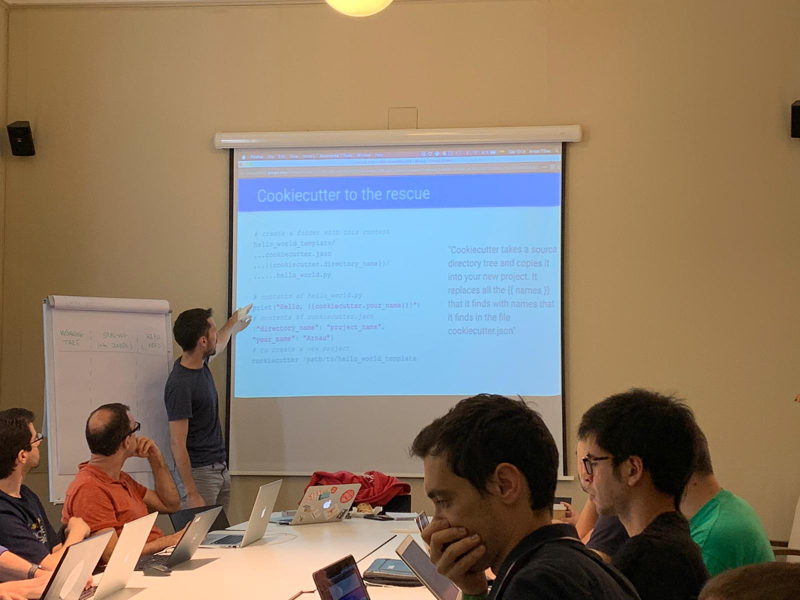
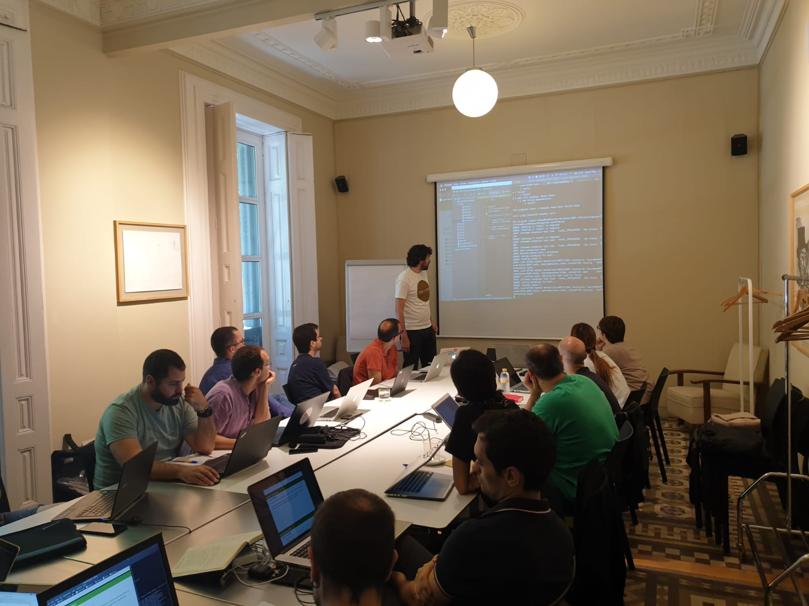

# Machine Learning in Production

Do you feel like you or your company are not shipping Data Science projects 
fast enough? Do your ML projects get stuck because there aren't available
developers to bring them to production? Do DevOps and SWE conversations
sound like Klingon to you?

Then this course may be for you! 

Join us to: 

- Become **more autonomous** and rely less on other Software Developers, DevOps and SysAdmins
- Become better Data Scientists by becoming better **Software Developers**
- Learn **methodologies, tools and processes** to ship models at scale

Our training offers:
- 24-hour of mostly hands-on training
- A low (5:1) student to instructor ratio
- Access to proprietary training materials
- 2 lunch meals to feed your hungry neurons!

> This course has provided me with a bunch of tools (kind of a Swiss Army knife) that have made my work day easier. 
> Now I have the basics needed to build a proper scaffold on which to develop my ML projects, so that they can be
> easily placed in production. It's a must!

-- Marta Dies, Data Scientist, ML in Prod 2019 alumnus

> The course was really useful to understand what tools are needed in order to put models into production

-- Cristian Pachón, Data Scientist, ML in Prod 2019 alumnus

<link href="https://d2poexpdc5y9vj.cloudfront.net/public/css/eventzilla-widget-button.css" rel="stylesheet" />
<a id="btnpreview" class="ewb-large ezilla-widget-button ezilla-blue" href="https://events.eventzilla.net/e/machine-learning-in-production-feb-2020-2138781722">Register Now - February 2020</a>

    

- [Most Machine Learning projects never see the light of day](#ml_dont_ship)
- [Our training](#our-training)
  * [Syllabus and schedule [Tentative]](#syllabus)
  * [Instructors](#instructors)
  * [Registration information](#registration)
  * [Requirements (Important)](#requirements)
  * [Past editions](#past-editions)
 
# Most Machine Learning projects never see the light of day 

With the advent of internet-scale data gathering, powerful big data platforms and new computing paradigms, 
most companies have embraced the Big Data and AI revolutions. As a result, billions have been invested to build all-mighty, 
data-powered features and services, in the hope of getting a competitive edge ahead of slower competitors. 

But alas, now that the dust is settling, a growing number of companies are starting to ponder: is 
this huge investment paying off? Is my bright, PhD-holding, Data Science team delivering on its promises?

The sad answer is that in many cases, our Return on Investment is not great. And it is not necessarily our fault.

## Data Science is hard to bring to production 

If you have been in the Data Science business for long enough, the following situation will likely sound familiar:

* You or one of your peers have a promising idea on how to apply Machine Learning to solve a problem
* You build a proof-of-concept, a prototype, using existing open-source libraries and lots of spaghetti code
run from a Jupyter Notebook
* Your Product Manager or Engineering Manager, loves the prototype and asks the Big Question: **when can we ship it?**

At this point you realize that you are not quite sure about the answer... How will you deploy the model? 
What infrastructure will it run on? The prototype kind of works, but will it generalize well to completely unseen data? 
How will you re-train it with a larger dataset? How will you work with other peers to iterate on the current model?

But you say something like "a couple of Sprints?" and hope for the best... only to realize 6 Sprints later that
the model isn't yet life and everyone is starting to wonder whether the time investment is worth it.

## Get better at shipping Machine Learning models 

Luckily at this point there are a number of people and companies (including us) who have been facing these problems
for a few years. In our experience, the key elements for successful ML deployment are:

1. Working with iteration and deployment in mind, from the start
2. Using tools and practices from Software Development
3. Knowing the basics of Data Engineering and DevOps to become more autonomous

The course will consist of theory and practical hands-on sessions lead by our four instructors, with over 20 years of
cumulative experience building and deploying Machine Learning models to demanding production environments at 
top-tier internet companies like edreams, letgo or La Vanguardia.

# Our training 

## Syllabus and schedule [Tentative] 

*Warning*: We are trying to come up with the most relevant content so this syllabus is still work-in-progress,
 which means it is susceptible to change. 

* Part I: Reproducibility & best practices for iteration and speed		
	* Conda, docker, makefiles
	* git
	* Python for pros 
	* Testing
	
* Part II: Production-grade training & ETLs
	* Airflow
	* Google Cloud Platform: BigQuery, GC Storage

* Part III: Production-grade deployment	
	* Container-based deployments
	* Kubernetes
	

	
## Instructors 

[**Bernat Garcia Larrosa**](https://www.linkedin.com/in/bernat-garcia-larrosa-9322869b/): Degree in Mathematics and Industrial Engineering. 
Former Data Scientist at Diari ARA and LaVanguardia.com. Current Director of Big Data at yaencontre.

[**Aleix Ruiz de Villa**](https://www.linkedin.com/in/aleixr/): PhD in Mathematics. Founder of the Barcelona Data Science and Machine Learning 
Meetup, cofounder of the Barcelona R Users Group and cofounder of BaDaSS. Former Head of Data Science at LaVanguardia.com, SCRM (Lidl) and Onna. 
Currently a consultant specialising in causal inference projects.

[**Tristana Sondon**](https://www.linkedin.com/in/tristanasondon/):  PhD in Computational Physics. A former Academic Researcher, she has been working 
for the past 5 years in Management consulting on areas of Data Science for banking, retail and ecommerce companies.
 Currently a Data Science Lead in the area of Revenue Management and Dynamic Pricing.

[**Arnau Tibau Puig**](https://www.linkedin.com/in/atibaup/): PhD in Electrical Engineering and flamenco lover. Former Principal Engineer at 
@WalmartLabs, Lead Data Scientist at Quantifind, both in the San Francisco Bay Area, CA. Current Head of Data Science at letgo, Barcelona.

## Registration information 

**Dates**:
- Friday February 28th, 2020, 17-21h
- Saturday February 29th, 2020, 10-19h
- Friday March 6th, 2020, 17-21h
- Saturday March 7th,2020, 10-19h

**Venue**: [Llibreria Laie](https://goo.gl/maps/bLJyseumEjuD5oaHA), C/ Pau Claris, 85, 08010 Barcelona

**Registration Fees**: 
* 750 euros per person
* 50% off for Master's or PhD students
* Reduced prices available for groups (contact us at bcn.mlinproduction@gmail.com)

**Language**: English

**Contact**: bcn.mlinproduction@gmail.com

<link href="https://d2poexpdc5y9vj.cloudfront.net/public/css/eventzilla-widget-button.css" rel="stylesheet" />
<a id="btnpreview" class="ewb-large ezilla-widget-button ezilla-blue" href="https://events.eventzilla.net/e/machine-learning-in-production-feb-2020-2138781722">Register Now - February 2020</a>

   

* Hurry up, registration **closes on February 21st, 2020**!
* The class size will be limited to 20 people.  While we will try to accommodate everyone interested, we also
 reserve the right to select students based on their experience level, in order to maximize the chances of a 
 successful learning experience. 

## Requirements (Important!) 

Applicants should have some experience with:
- Machine Learning
- Python
- Unix command line tools

Students must bring a laptop equipped with:
- Linux/MacOS 
- You favorite IDE (examples: Vim, Sublime, PyCharm, Emacs...)
- A configured environment as [explained here](env_setup/index.md)

**Important**: Please follow the [environment setup instructions](env_setup/index.md)
prior to the beginning of the course to ensure a smooth learning experience.

## Past editions 

We organized a [June 2019 edition of this training](https://mlinproduction.github.io/2019/) in Barcelona, Spain. 
**100% of our post-course survey respondents said they would recommend it to a friend**, and we have incorporated their suggestions
on how to make 2020 edition even better!

